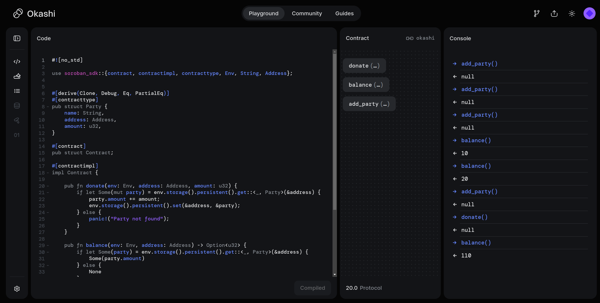
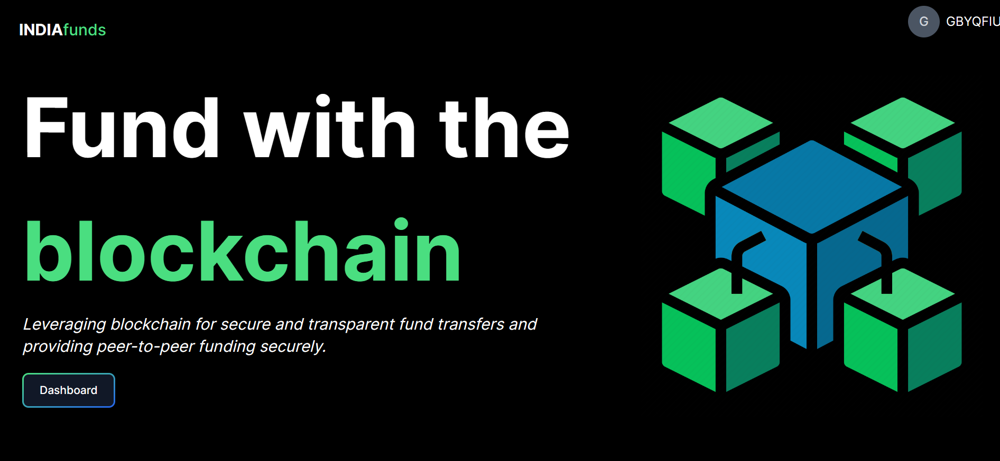

# DApp Description: Token Transfer to Fixed Parties

## Objective
Our decentralized application (DApp) allows users to transfer tokens to one of four fixed parties. Each party has a predefined wallet address hardcoded into the system. Users can choose their preferred party and transfer a specified amount of tokens to support or interact with that party.



TL;DR : 

```
Our DApp provides a transparent and secure platform for users to transfer funds to predefined parties. By leveraging blockchain technology, we ensure that every transaction is transparent and secure, fostering trust and accountability between donors and fundraisers. The hardcoded addresses and clear user interface make it easy for users to support the parties they care about while having confidence in the integrity of the process.
```

## Concept

1. *Four Fixed Parties*:
    - The DApp has four parties with their wallet addresses hardcoded into the smart contract.
    - These parties represent specific entities or stakeholders within the ecosystem.

2. *User Interaction*:
    - Users, upon connecting their wallets (e.g., MetaMask for Ethereum), can choose one of the four parties to transfer tokens to.
    - The user specifies the amount of tokens they wish to transfer.

3. *Token Transfer Process*:
    - Once the user initiates the transfer, the smart contract verifies the user’s balance.
    - If the user has sufficient tokens, the specified amount is deducted from their balance and credited to the chosen party’s address.
    - The transaction is recorded on the blockchain, ensuring transparency and immutability.

4. *Benefits*:
    - Simplified user experience with a clear and straightforward transfer process.
    - Hardcoded addresses ensure reliability and trust in the destination of the funds.
    - Supports multiple users making transactions to the same or different parties concurrently.

## Example Scenario

1. *User Onboarding*:
    - User1 visits the DApp platform and connects their MetaMask wallet.
    - User1 sees an interface listing the four parties they can transfer tokens to.

2. *Selecting a Party*:
    - User1 decides to transfer tokens to Party A.
    - User1 enters the amount (e.g., 2 tokens) and confirms the transfer.

3. *Transaction Execution*:
    - The smart contract checks User1’s balance.
    - Upon verifying sufficient funds, the smart contract deducts 2 tokens from User1’s balance and credits them to Party A’s address.
    - The transfer event is logged on the blockchain.

4. *Multiple Users*:
    - Other users can simultaneously transfer tokens to any of the four parties.
    - Each transaction is handled independently by the smart contract.

## Technical Implementation

1. *Smart Contract (Ethereum/Solidity)*:
    - Hardcoded addresses for the four parties.
    - Transfer function to handle token transfers from users to the specified party.
    - Event logging for transparency.

2. *Frontend Interaction*:
    - Connect MetaMask for wallet integration.
    - User interface to select parties and enter token amounts.
    - JavaScript (using web3.js or ethers.js) to interact with the smart contract.

3. *Security and Validation*:
    - Ensure all transactions are securely signed and validated.
    - Handle edge cases such as insufficient balances and invalid inputs.


## Social Impact 

```
- Reduces corruption and misuse of funds.
Increases donor confidence in political parties.
Promotes accountability within political parties.

- Encourages fair competition in the political landscape.
Helps emerging political parties gain financial support.
Reduces the dominance of well-funded entities, promoting a more diverse political environment.

```

By providing a user-friendly interface and ensuring the integrity of the transactions through smart contract logic, the DApp facilitates seamless token transfers to the fixed parties, empowering users to interact with and support the parties of their choice.

